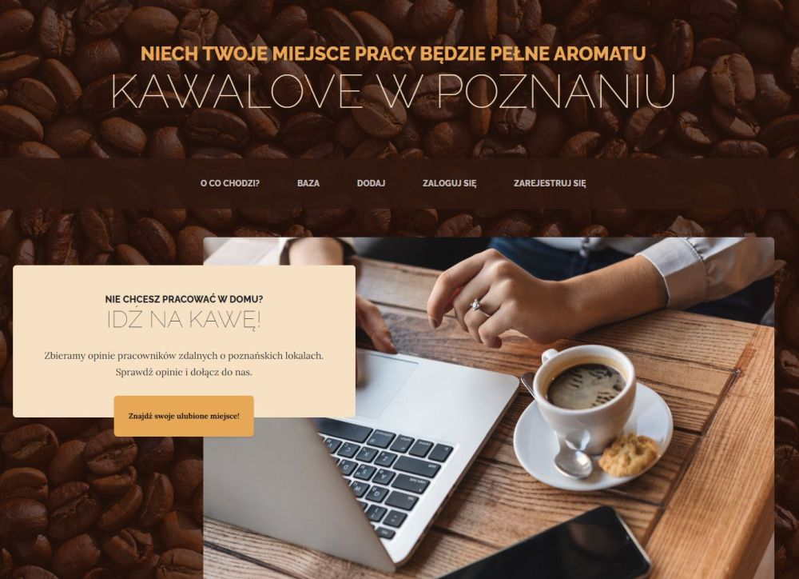
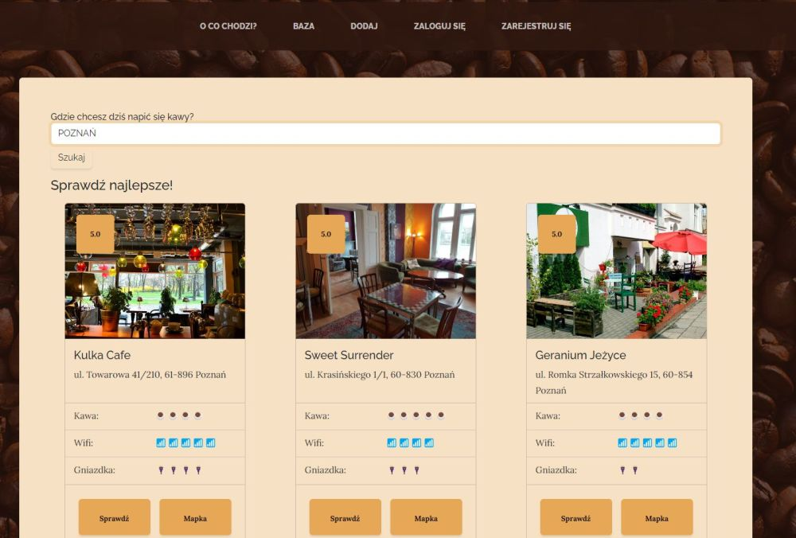
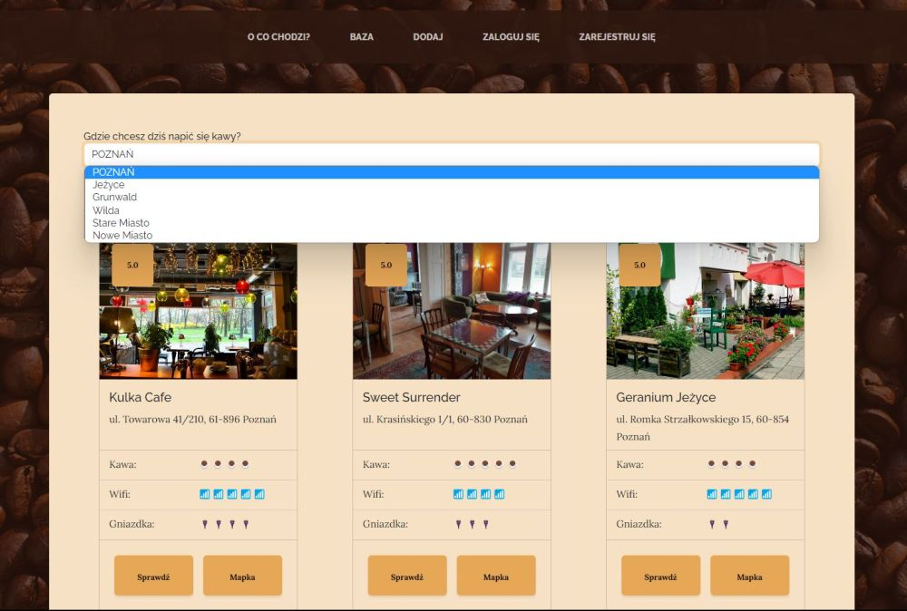
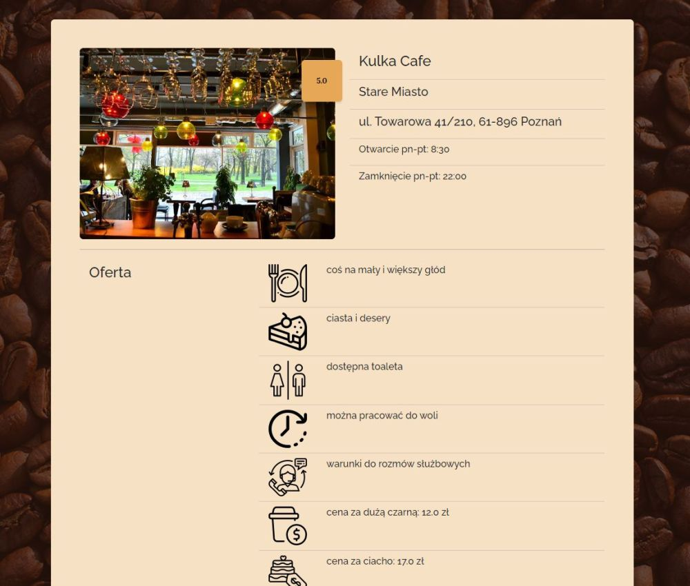
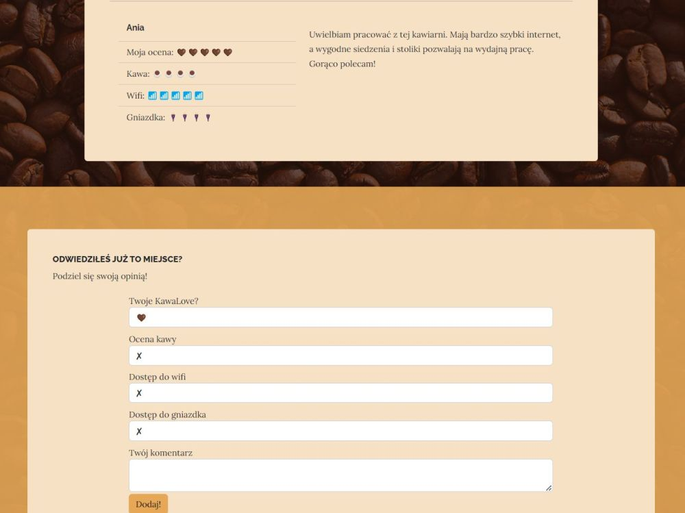
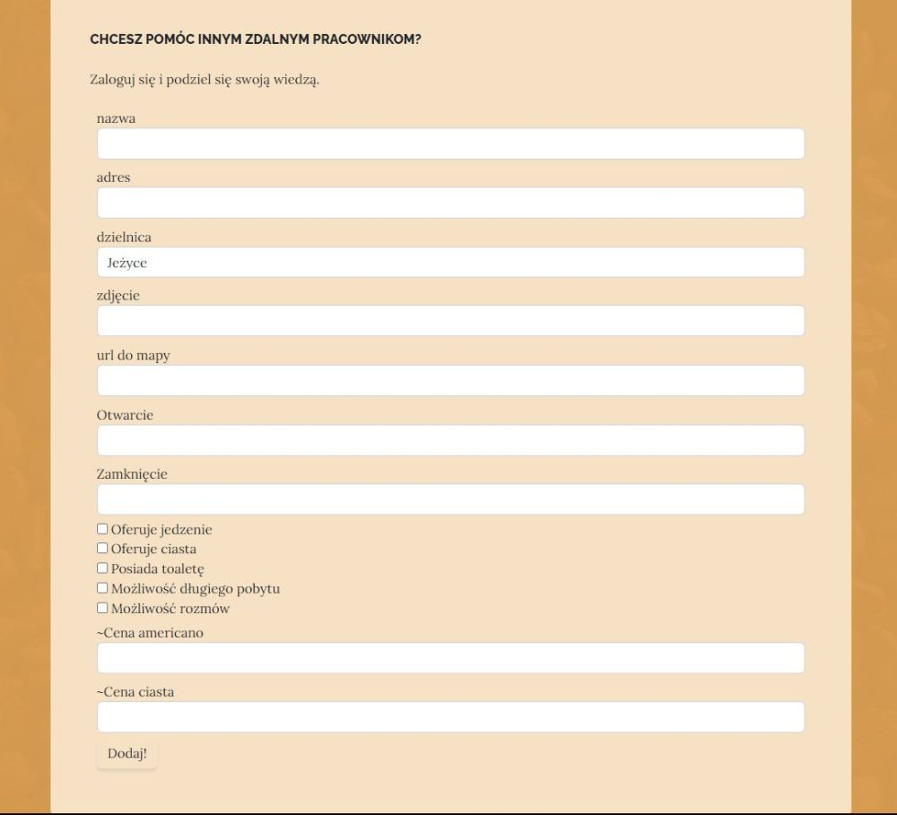
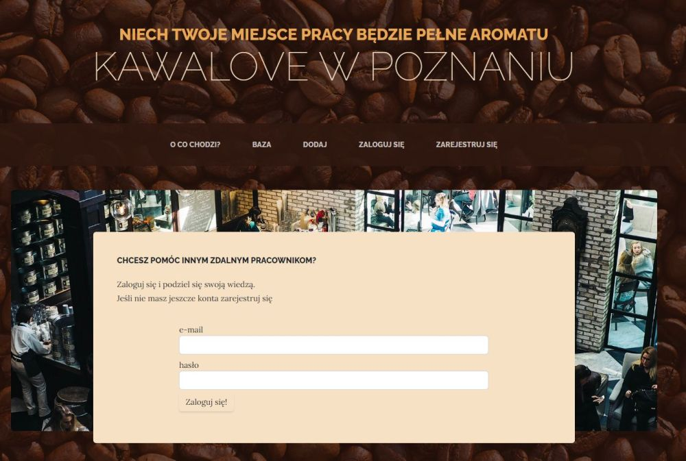
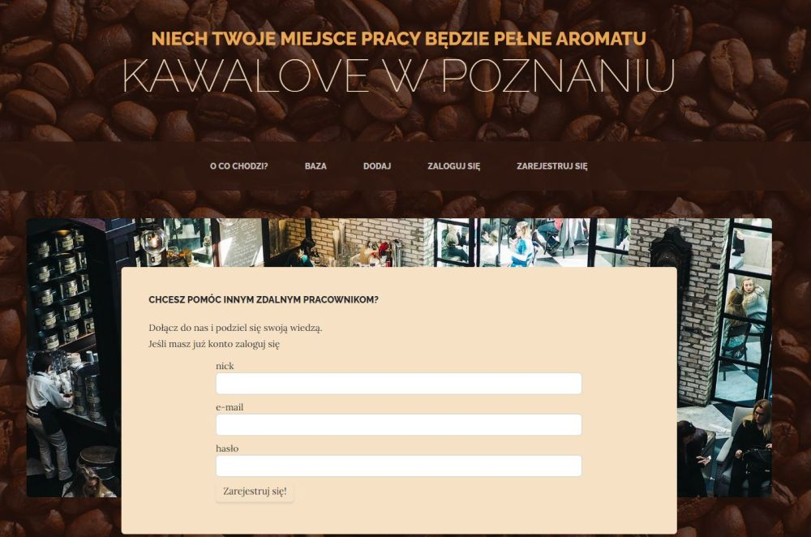

# kawalove-website
KawaLove app - website with a database of cafes in Poznan and remote workers' reviews who are looking for a good place to work.
Link: https://kawalove.onrender.com

Opis projektu:
Portal mający za zadanie wyszukiwanie kawiarni, która będzie wygodnym miejscem do pracy zdalnej. Zawiera możliwość szukania kawiarni wg dzielnic Poznania, sprawdzenie komentarzy i opinii użytkowników oraz dodanie swojej oceny lub nowej kawiarni do bazy. 

BACKEND:
Python
Flask
Jinja
Biblioteki: WTForms, CKEditor, Werkzeug, SQLAlchemy

FRONTEND:
HTML
CSS
BOOTSTRAP (na bazie https://startbootstrap.com/theme/business-casual)

Rozwiązania:
- utworzenie oraz modyfikacje bazy danych kawiarnie/użytkownicy/komentarze za pomocą SQLAlchemy oraz ich powiązanie ze sobą (relacje)- 
- uwierzytelnianie użytkowników (rejestracja oraz logowanie) za pomocą Flask-Login, Werkzeug
- formularze rejestracji/logowania/komentarze/dodawanie do bazy za pomocą WTForms 
- nadanie uprawnień do usuwania/edycji wpisów jedynie adminowi
- na podstawie ocen użytkowników ustalenie średniej oceny kawiarni w danym obszarze (ogólna ocena, kawa, wifi, dostęp do gniazdek)
- deployment aplikacji za pomocą render.com

Screeny:

Instalacja:
Zgodnie z requirements.txt

Uruchomienie:
python main.py

